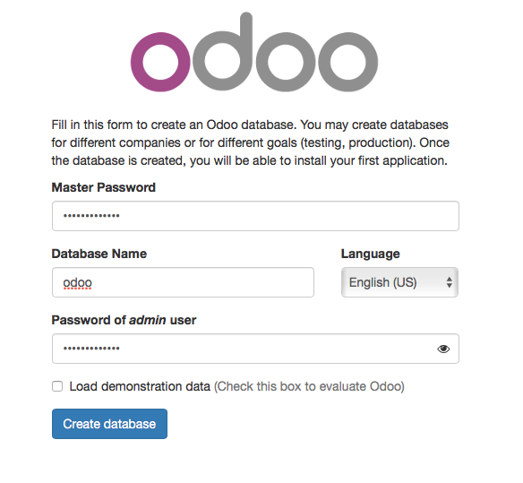

## Modular apps

[](https://travis-ci.org/ignorethegap/modular-apps)

Collection of sample Website, Web App, Mobile App, Iconography and common Libraries.
In your own company you might break these out as separate repositories

### website.com

In website.com you have a jQuery based site that was written a while ago and still works fine.
Some of the functionality is needed in apps so you want to extract it to common libraries.

### sales.website.com

In sales.website.com you have an Angular based web app for partners and sales agents.


Dependencies
------------

* VirtualBox
* Vagrant 1.6.1
* Ansible

Setup
-----

### Up and running without a backend

You can develop without a backend limiting the amount of testing possible.

```
npm install
npm start
```

### Odoo backend

As a sample backend Odoo represents your own Enterprise systems (ERP/CRM/etc)
Developing you would run a test system locally. The alternative is to run tests
against a deployed test system at `http://erp.htlm5demoapp.com`.

1. Download and Install Ansible http://docs.ansible.com/intro_installation.html


1. Download and install vagrant (the OR based wget allows COVETEL people to get it from a local mirror)

   ```
$ wget http://mirror/files/deb/vagrant_1.6.2_x86_64.deb || wget http://dl.bintray.com/mitchellh/vagrant/vagrant_1.6.3_x86_64.deb
$ sudo dpkg -i vagrant_1.6.2_x86_64.deb

   ```

1. Setup vagrant box.

   ```
$ vagrant box add debian7 http://iweb.dl.sourceforge.net/project/vagrantdebianboxes/debianwheezy.box

   ```

1. Start the VM

   ```
$ vagrant up
   ```

Once started which will take 15 minutes the first time the ERP system can be accessed locally
at `http://localhost:8069`.   
The first time you access it you must configure a new database. To be consistent name it `odoo`. The passwords are configured in the playbook.xml, it is configured as `SuPerPassWorD`.

